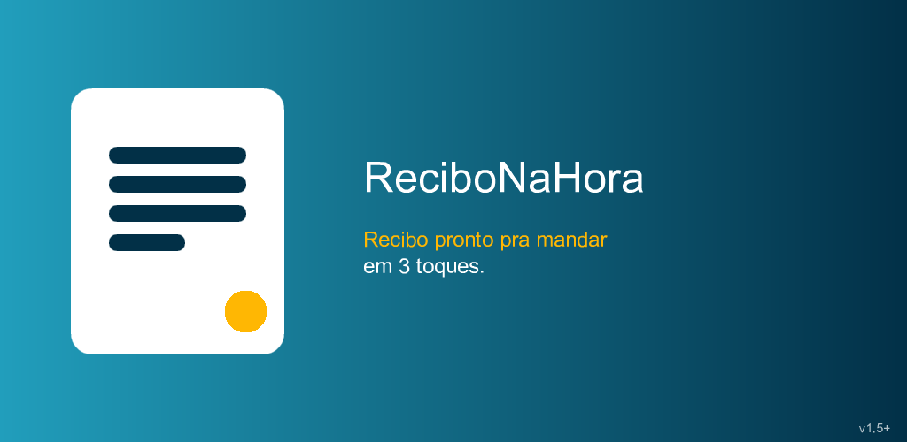
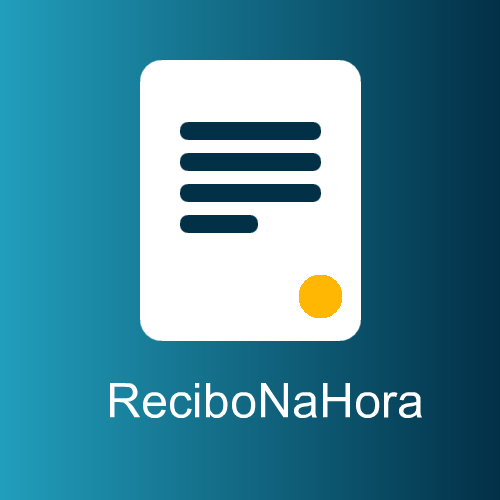

# Recibo na Hora

**Recibo profissional em segundos — pronto pra mandar no WhatsApp.**

---

App de celular pra quem precisa entregar um **comprovante bonito na hora** — autônomo, MEI, assistência técnica, prestador de serviço. Cadastra sua empresa e seus clientes uma vez só; depois é escolher os itens, gerar, e mandar. Sem planilha, sem template quebrado do Word, sem "depois eu te mando o recibo".

- 🧾 **Recibo pronto em 3 toques** — selecionar cliente, adicionar itens, gerar. O número é sequencial e o valor sai por extenso automático, com validade jurídica.
- 📤 **Manda direto no WhatsApp** — o mesmo documento vira PDF pra compartilhar, anexar por e-mail, imprimir (Bluetooth/Wi-Fi) ou salvar na galeria.
- 💼 **Orçamento também** — cria com validade ("Válido até DD/MM"). Cliente aprovou? Converte em recibo de verdade em 1 toque.
- 📊 **Entende seu negócio** — quanto vendeu, quanto custou, quanto lucrou, produtos mais vendidos e clientes que mais gastaram.
- 📦 **Estoque básico** — baixa automática ao emitir, reposição ao cancelar.
- 🔐 **100% offline, seus dados são seus** — funciona sem internet, tudo fica só no seu celular, backup completo em um arquivo (`.recibobackup`). Sem conta, sem cadastro.

> **Sem assinatura. Sem propaganda.** De graça, do jeito que app de recibo devia ser.

## 🎨 Modelos de documento

Um único motor de render, quatro papéis diferentes na saída:

- **Produtos e Serviços** — tabela completa (descrição, valor, qtd, total), subtotal, desconto, forma de pagamento e garantia
- **Compacto** — um bloco minimalista, direto ao ponto
- **Pagamento Autônomo** — texto corrido "Recebi de [cliente] a importância de…" com valor por extenso
- **Personalizado** — você escolhe cor, campos e alinhamento

## 🖼️ Telas

O app está em desenvolvimento e os prints das telas reais chegam junto com o lançamento no Google Play. Por enquanto, a cara do produto:

## ✨ Extras que fazem diferença

- Numeração automática sequencial (nunca duplica nem pula número)
- Valor por extenso em português (recibo com valor jurídico)
- Máscaras de CPF/CNPJ e telefone enquanto você digita
- Assinatura desenhada na tela (empresa e cliente)
- Múltiplas empresas emissoras no mesmo app
- Busca rápida por número ou cliente e exportação da lista do mês em PDF
- Moeda configurável (R$, US$, €)

## 🚀 Status

**Em desenvolvimento — chegando ao Google Play (Android).** O app já gera recibos, orçamentos, PDF e backup; agora está na reta de polimento e publicação. Acompanhe a página do projeto pra saber quando abrir o teste:

➡️ **[paulocodex.com/p/recibo-na-hora](https://paulocodex.com/p/recibo-na-hora)**

## 🥷 Mascote

Todo projeto do estúdio tem o **ninja Codex** na cor da sua identidade — o mesmo mascote da casa, recolorido pro tema do **Recibo na Hora**.

 

## 👤 Sobre o desenvolvedor

**Paulo Adriel** é produtor de vídeo e desenvolvedor indie brasileiro. Construo o produto **e** a apresentação dele — código + identidade visual, motion e material de lançamento — do zero ao ar em 30 dias. Trabalho de forma aberta e escuto quem usa. Estúdio [**Paulocodex**](https://paulocodex.com).

 

---

📧 [contato@paulocodex.com](mailto:contato@paulocodex.com) &nbsp;·&nbsp; 🌐 [paulocodex.com](https://paulocodex.com) &nbsp;·&nbsp; 📸 [Instagram](https://instagram.com/paulodev.codex) &nbsp;·&nbsp; 💼 [LinkedIn](https://www.linkedin.com/in/paulo-adriel/) &nbsp;·&nbsp; 🐙 [github.com/Paulothedeveloper](https://github.com/Paulothedeveloper)

_Repositório de **apresentação pública** — o código-fonte é fechado. Nada de dado ou segredo aqui._

